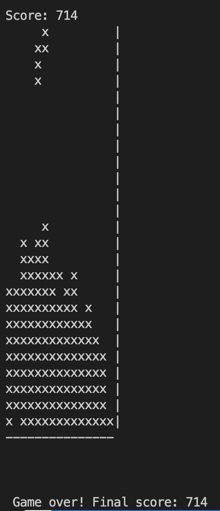

# Game Playing AI for Tetris


For human interactive gameplay (Works on Linux and Mac, may or may not work on Windows):
```{bash}
python3 ./quintris.py human animated
```

For computer (AI) gameplay:
```{bash}
python3 quintris.py computer simple
```
**or**
```{bash}
python3 quintris.py computer animated
```

## **Play Quintris**

**Task** : Play the game of quintris

Problem formulation:
Arrange the pieces of the game in such a way that the maximum number of rows are filled with 'x's. Once this condition is satisfied, the row is cleared and the score is incremented.

We play this game until the board is full and then return the final score.

Approach:
Create a game tree of depth 2 where we drop the current and the next piece onto different positions of the board, which is possible because of the successor function. Once we have a board, we check it's utility.
We return the sequence of board with the maximum number of moves.

To achieve the highest score possible, we focus on the following functions:

1) Successor function
2) Utility function

Successor function:

Terminology: 

move -> Any move of the following moves: left(b), right(m), rotate(n), horizontal_flip(h)

sequence -> a combination of moves in any order.

Given a board and a piece, we generate all possible sequences for the piece to fall on the board. We did try successor sequence based on the incoming piece, but we could not do it in time. After this, we perform the same operation for the next piece, which we know before. Once we know that we have reached a terminal state (both the pieces are down), which usually happens at depth 2, we then find the utility of the board, using the utility function.

Whichever utility is the highest, we return the sequence associated with the board.

Utility function:
The utility function can determine the value of the board. It is a weighted average of the following criteria:

+ Number of holes in the board: The less the number of holes, the better the board is.
Holes are the number of empty spaces available after the peak 'x', performed column-wise. It's weight is (1/(2*n_holes)).
+ Heights of the columns: The heights of the columns are important. We want the heights to be uniform accross the board. Hence we take the differnce of maximum and minimum column heights and try to minimize it. The portion of heights_difference in the utility function is (1/(5*height_difference)).
+ Spaces: Number of whitespaces in all the rows with an 'x'. We penalize this heavily, since we want to match a row, by minimizing the number of spaces as much as possible. The portion of spaces in the utiity function is (1 / space_count).
+ Number of pits: The number of columns with no 'x's in them. We want every column to have atleast 1 of 'x'. Hence, the factor of pits in utility function is (1/n_pits)
+ We multiply the sum of the above 4 with 100.
+ Score: If there is an increase in score due to a piece dropping from the top to the bottom, we reward it heavily. The factor to add is 100*score.

Results:
Let's start with the unique pieces.

```python
{'A': [' x ', 'xxx', ' x '], 'B': ['xxxxx'], 'C': ['xxxx', '   x'], 'D': ['xxxx', '  x '], 'E': ['xxx', 'x x'], 'F': ['xxx ', '  xx']}
```

We get the best score when we get the following pieces most frequently in the following order: B, C, D and F.



In our opinion, pieces A and E are the most troublesome, since they tend to create a lot of unwanted spaces in many rows.
Assuming that B, C, D and F are in 'easy mode' we can get a high score.
Hence, depending on the pieces, the usual score range lies between 0 to 100, depending on the pieces and their frequencies.
